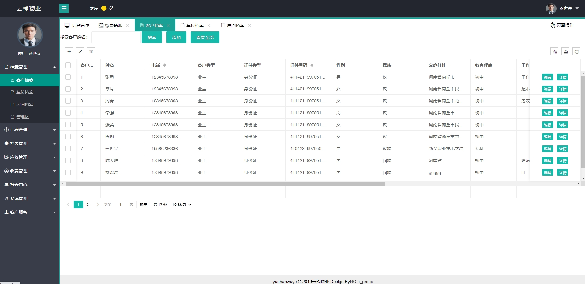
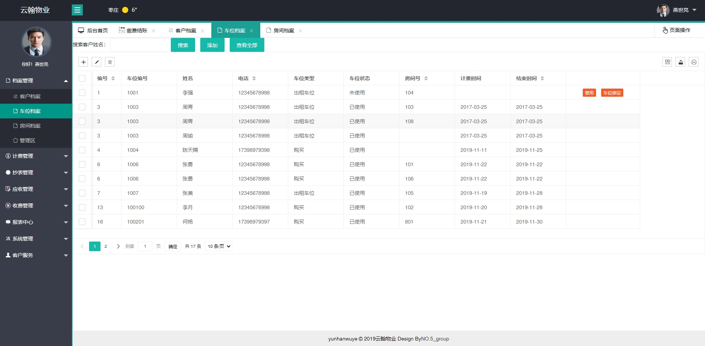
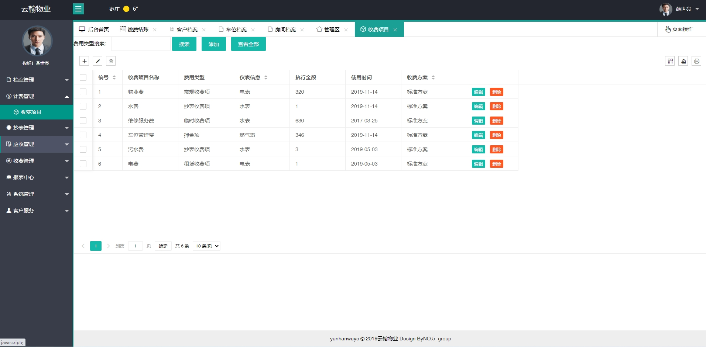
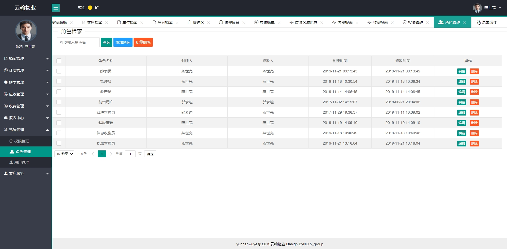
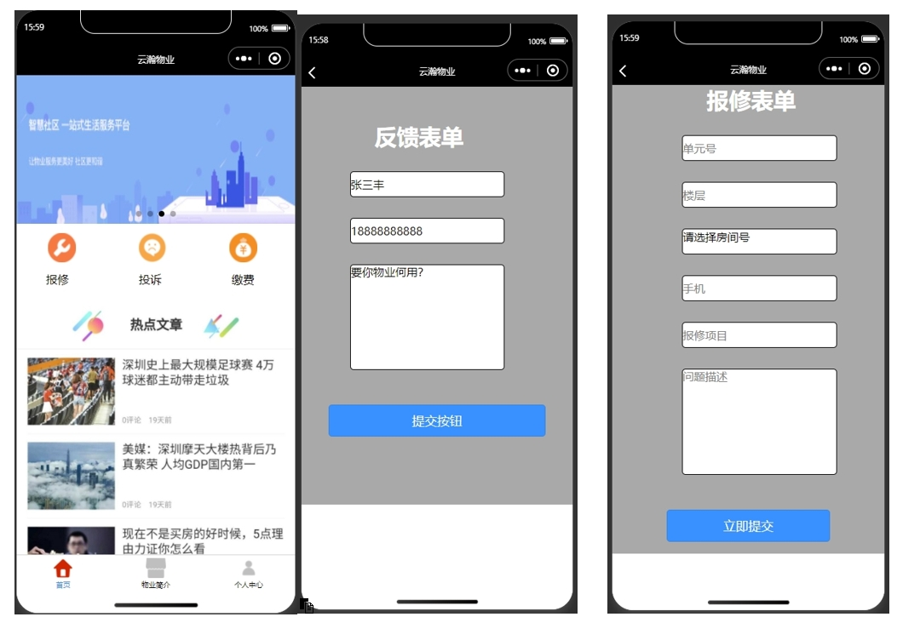
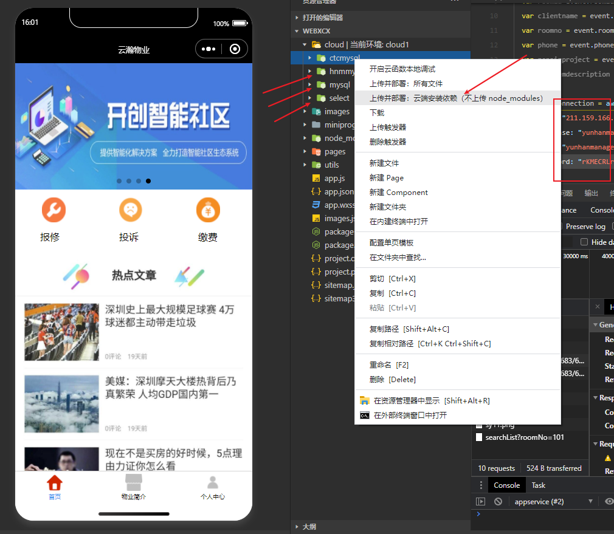

**郑重声明：项目经过本地测试，确保可以运行。项目仅供学习和毕业设计参考~**
 
**[点我获取源码](https://x-x.fun/e/MZ2aeaa1c2x3T)💕🤞**

 **[点我查看更多](http://blog.cyrobot.top/blog)💕🤞** 

#### 1.项目介绍
技术框架：SpringBoot + SSM+ shiro + layui + 小程序云函数
运行环境：IntelliJ IDEA 2022 + jdk1.8 + Mysql5.7 + maven +微信开发工具

 **提供部署视频和相关文档~** 

系统功能介绍：

系统用户管理、单元楼管理、住户信息管理、停车场管理、物业收费管理、住户报修管理、住户投诉管理

档案管理：客户档案、车位档案、房间档案、管理区

计费管理、抄表管理、应收管理、收费管理、报表中心、系统管理、客户服务、收费项目

客户服务：投诉建议、报修工单

系统管理：权限管理、角色管理、用户管理

收费项目：收费项目名称、费用类型、仪表信息、执行金额、使用时间、收费方案

仪表抄表：楼宇、房间编号、仪表编号、客户姓名、仪表类型、抄表期、抄表结束期

使用用量、收费标准、抄表人、上次指数、本次指数、抄表类型、抄表日期、备注

报表中心：应收区域汇总、欠费报表、收费报表

报修工单：受理派工、报修项目、紧急程度、问题描述、受理信息、受理人、要求完成时间

#### 2.项目部署
##### 2.1 后端项目部署

- 创建数据库，导入项目中的sql文件
- 打开IDEA，导入项目wyadmin， 根据本地数据库环境，修改配置文件内的数据库连接
- 启动项目，localhost:8080  管理员账号密码： admin/123456 ,其他角色自行创建~

##### 2.2 小程序启动

- 打开微信开发工具，导入项目，注意修改小程序的appid，选择云函数环境
- 创建并部署与云函数，修改云函数内的数据库配置（自行准备云数据库），具体参考:http://blog.cyrobot.top/blog/article/148 ,配置很简单
- 微信授权登录即可~

#### 3.项目部分截图

